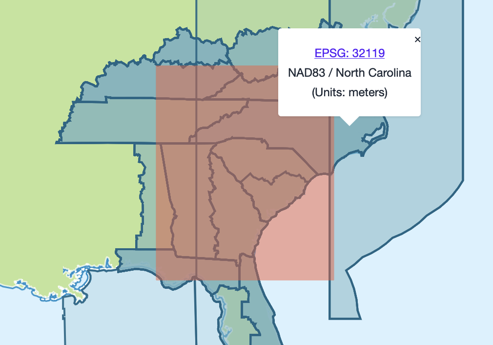

<Accordion title="What's a coordinate system?" icon="globe">
  Coordinate systems describe how coordinates relate to points on the Earth and come in two forms: geographic and projected.

  [Geographic coordinate systems (GCS)](https://en.wikipedia.org/wiki/Geographic_coordinate_system), like [WGS84](https://en.wikipedia.org/wiki/World_Geodetic_System#1984_version), represent points on the Earth as degrees: latitude and longitude. Because the units of geographic coordinate systems are angles and not distance, the results of operations like distance and area are unusable.

  To use distance and area in units of meters or feet, spatial data must be converted from a GCS to a [projected coordinate system (PCS)](https://en.wikipedia.org/wiki/Projected_coordinate_system). There are thousands of PCS's that cover the Earth, of varying units, areas, and distortions.
</Accordion>

## Automatic vs. manual

[Manually choosing an appropriate projection](https://buntinglabs.com/tools/choose-projected-coordinate-system) for your spatial data can be tedious.

In most cases, automatically choosing a projection for your data can accomplish
your analysis without visible side effects. By default, mundi.py will choose the projection
expected to minimize distortion for your operation, and will convert geometries back to latitude and longitude (EPSG:4326) after the operations.

<Frame>
  
</Frame>

GeoPandas also has [`gdf.estimate_utm_crs()`](https://geopandas.org/en/stable/docs/reference/api/geopandas.GeoDataFrame.estimate_utm_crs.html), which is similar but not the default.

If desired, projections can be chosen manually. [This article](https://mdl.library.utoronto.ca/technology/tutorials/selecting-right-projection) may be a helpful guide if you need help choosing.
