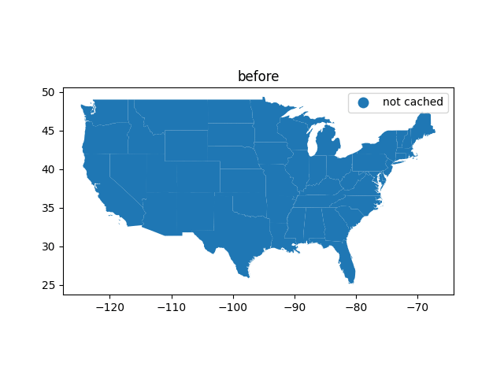

<Accordion title="What's a footprint?" icon="vector-polygon">
  If a spatial query result is constant for an entire region, that result's *footprint* is the region. For example, a country query by point can be cached with the country's border as the *footprint*.
</Accordion>

Caching the results of expensive queries, like API calls or compute-heavy functions on DataFrames, can dramatically speed up the execution of a spatial program. In Python, adding the `functools.lru_cache` decorator to an existing function makes caching convenient by wrapping a function and hashing its arguments.

This library provides a variety of spatial LRU (drops the least-recently used) cache that can be easily integrated into an existing spatial query.

## Spatial footprint cache

The footprint spatial cache considers every function execution to have a *spatial footprint* in which that execution is valid. During a cache miss, the function must return a `shapely` geometry in which all subsequent executions have the same value in addition to the function's result.

For example, a spatial footprint cache is useful if we were to calculate nationality based on one's place of birth. The first execution might be `f('New York City') => 'American'`. With the spatial footprint cache, we would return the United States' border, in which all future calls can resolve to `'American'`.

<Frame>
  
</Frame>

> An animation of calculating the state a point is in, annotated with whether the state has been cached and if it's a cache hit or miss.

When we wrap a function in `spatial_footprint_cache`, we must change the return value. Calls should return a two-tuple, `(result, footprint)`, where `footprint` is a `shapely` geometry or `None` if the result should not be cached.

```py cache_nationality.py
from geopandas import gpd
from mundipy.cache import spatial_cache_footprint
from shapely.geometry import Point

nations = gpd.read_file('national_borders.geojson')

@spatial_cache_footprint
def calculate_nationality(place_of_birth: Point):
	# find the nation that contains this point
	nation = nations[nations.contains(place_of_birth)]

	if len(nation) < 1:
		# do not cache
		return (None, None)
	else:
		# return first nation that contains the point
		return (nation.iloc[0]['name'], nation.iloc[0]['geometry'])
```

The result will be cached for the `geometry` that is returned.

The size of the cache can be tweaked with `@spatial_cache_footprint(maxsize=128)`.

### Cache info

Statistics about cache hits or misses can be shown with `fn.cache_info`:

```py
print(fn.cache_info)
# {'hits': 1, 'misses': 3}
```
