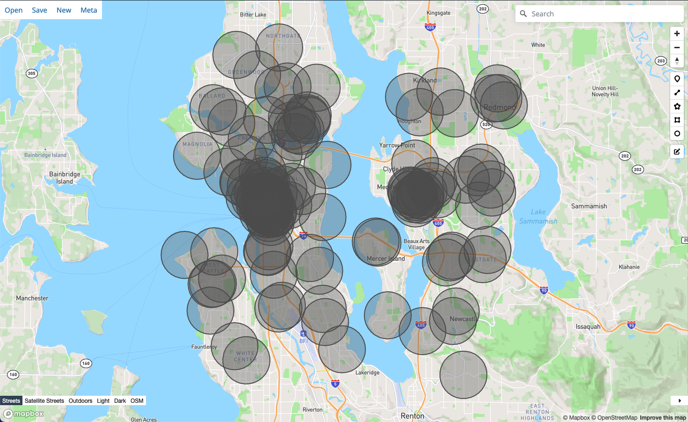

<Tip>In retail and commercial real estate, a **catchment area** of a store represents the typical area where visitors of the store live.</Tip>

Because it's hard to estimate how many people might visit a particular retail location
without observed data, geospatial analysts use **catchment areas** to approximate how many
people *could* reasonably visit a retail location.

<Frame>
  <div style={{display: "flex", "flexDirection": "column", "alignItems": "center"}}>
    
    <span style={{"fontStyle": "italic", "marginTop": "20px"}}>**Above**: catchment area around a Starbucks in Seattle</span>
  </div>
</Frame>

In this tutorial, we'll learn to calculate the average demographics of catchment areas.
We'll use mundipy with population data from the US census bureau and retail location data
(POI) from OpenStreetMap.

<Note>Following along with this tutorial takes about **ten minutes**.</Note>

## Getting Setup

### Population Data

We'll analyze the demographics surrounding various Starbucks coffeeshops in Seattle.
We can download this POI ("points of interest") data by filtering for `name=Starbucks` on [OpenStreetMap](https://www.openstreetmap.org/) via [Overpass Turbo](http://overpass-turbo.eu/). You can download this data as [`starbucks_in_seattle.geojson` from this gist](https://gist.github.com/brendanashworth/1566a397cf5d3d7ea22599431e279653).

U.S. Census data offers free geospatial demographic datasets of varying resolutions. Here, we can use population counts aggregated by zip code (ZCTAs). You can create this on your own with the [Census data downloader](https://github.com/datadesk/census-data-downloader), or download this data as [`population_zip_code.fgb` (**WARNING: 1GB**)](https://pub-f49c63ed10ee494eb0deeb568b66f33f.r2.dev/population_zip_code.fgb).

You're ready to continue with `population_zip_code.fgb` and `starbucks_in_seattle.geojson`
in your root directory.

### Installing mundipy

You can install mundipy normally with `pip` via [its PyPi project](https://pypi.org/project/mundipy/):

```sh
pip install mundipy
```

<Note>If you have issues installing the `shapely` dependency, this [shapely installation guide](https://shapely.readthedocs.io/en/latest/installation.html) may be useful in debugging.</Note>

## Datasets

### Loading datasets

We'll start with the Starbucks dataset by creating a `Dataset` object and passing it the GeoJSON file location.

```python
from mundipy.dataset import Dataset

starbucks = Dataset('starbucks_in_seattle.geojson')
zip_codes = Dataset('population_zip_code.fgb')
```

We can check the number of features we loaded with `len`:

```py
len(starbucks)
# 128

len(zip_codes)
# 32923
```

If you're in a Jupyter notebook, you can leave `starbucks` as the last variable in a code
block and it'll visualize the dataset as an SVG, confirming we have a bunch of points:

<Frame>
  <svg xmlns="http://www.w3.org/2000/svg" xmlns:xlink="http://www.w3.org/1999/xlink" width="300.0" height="200.0" viewBox="-122.422804656 47.493381944 0.3144057119999957 0.22432471200000492" preserveAspectRatio="xMinYMin meet"><g transform="matrix(1,0,0,-1,0,95.21108)"><path fill-rule="evenodd" fill="#66cc99" stroke="#555" stroke-width="0.002096038079999971" opacity="0.6" d="M -122.1320405,47.6221505 L -122.1320928,47.6221509 L -122.1320936,47.6220997 L -122.1320954,47.6219967 L -122.1318624,47.6219949 L -122.1318609,47.6220716 L -122.1318598,47.6221497 L -122.1319853,47.6221507 L -122.131985,47.6221688 L -122.1320402,47.6221692 L -122.1320405,47.6221505 z" /></g><g transform="matrix(1,0,0,-1,0,95.21108)"><path fill-rule="evenodd" fill="#66cc99" stroke="#555" stroke-width="0.002096038079999971" opacity="0.6" d="M -122.1308143,47.6171611 L -122.1307005,47.6171604 L -122.1306987,47.617291 L -122.1308126,47.6172917 L -122.1308143,47.6171611 z" /></g><g transform="matrix(1,0,0,-1,0,95.21108)"><path fill-rule="evenodd" fill="#66cc99" stroke="#555" stroke-width="0.002096038079999971" opacity="0.6" d="M -122.1289143,47.6749972 L -122.128914,47.6749555 L -122.1289137,47.6748913 L -122.1288906,47.6748913 L -122.1288902,47.674827 L -122.1287992,47.6748272 L -122.1287999,47.6749369 L -122.128778,47.674937 L -122.1287783,47.6749747 L -122.1288338,47.6749745 L -122.1288339,47.6749974 L -122.1289143,47.6749972 z" /></g><g transform="matrix(1,0,0,-1,0,95.21108)"><path fill-rule="evenodd" fill="#66cc99" stroke="#555" stroke-width="0.002096038079999971" opacity="0.6" d="M -122.2967832,47.577066 L -122.2969384,47.5770094 L -122.296848,47.5768966 L -122.2966928,47.5769532 L -122.2967832,47.577066 z" /></g><g transform="matrix(1,0,0,-1,0,95.21108)"><path fill-rule="evenodd" fill="#66cc99" stroke="#555" stroke-width="0.002096038079999971" opacity="0.6" d="M -122.3253908,47.6799332 L -122.3253888,47.6800616 L -122.3254078,47.6800617 L -122.3254062,47.6800847 L -122.3255988,47.6800687 L -122.3255998,47.6800374 L -122.3255778,47.6800372 L -122.3255778,47.6800244 L -122.3255918,47.6800245 L -122.3255918,47.6800016 L -122.3255798,47.6800016 L -122.3255808,47.6798995 L -122.3254478,47.6798987 L -122.3254478,47.6799155 L -122.3254058,47.6799152 L -122.3254048,47.6799333 L -122.3253908,47.6799332 z" /></g><g transform="matrix(1,0,0,-1,0,95.21108)"><path fill-rule="evenodd" fill="#66cc99" stroke="#555" stroke-width="0.002096038079999971" opacity="0.6" d="M -122.2851253,47.5457799 L -122.2850906,47.5457065 L -122.2850607,47.5456533 L -122.2850366,47.545653 L -122.2850322,47.5457808 L -122.2851253,47.5457799 z" /></g><g transform="matrix(1,0,0,-1,0,95.21108)"><path fill-rule="evenodd" fill="#66cc99" stroke="#555" stroke-width="0.002096038079999971" opacity="0.6" d="M -122.1777009,47.6790732 L -122.1778059,47.6790721 L -122.1778062,47.6790852 L -122.1780321,47.6790828 L -122.1780296,47.6789766 L -122.1779165,47.6789778 L -122.1779161,47.678962 L -122.1777983,47.6789632 L -122.1777986,47.6789727 L -122.1776986,47.6789737 L -122.1777009,47.6790732 z" /></g><g transform="matrix(1,0,0,-1,0,95.21108)"><path fill-rule="evenodd" fill="#66cc99" stroke="#555" stroke-width="0.002096038079999971" opacity="0.6" d="M -122.3254065,47.6409932 L -122.3254066,47.6410548 L -122.3254992,47.6410546 L -122.3254992,47.6410689 L -122.3257022,47.6410686 L -122.325702,47.6409928 L -122.3254065,47.6409932 z" /></g><g transform="matrix(1,0,0,-1,0,95.21108)"><path fill-rule="evenodd" fill="#66cc99" stroke="#555" stroke-width="0.002096038079999971" opacity="0.6" d="M -122.3719755,47.6298349 L -122.3719831,47.6298412 L -122.3719067,47.6298833 L -122.371973,47.6299383 L -122.3720522,47.6298947 L -122.37206,47.6299011 L -122.3721201,47.629868 L -122.3721134,47.6298624 L -122.3722055,47.6298118 L -122.3721306,47.6297495 L -122.3719755,47.6298349 z" /></g><g transform="matrix(1,0,0,-1,0,95.21108)"><path fill-rule="evenodd" fill="#66cc99" stroke="#555" stroke-width="0.002096038079999971" opacity="0.6" d="M -122.3337765,47.5841256 L -122.3337767,47.5842587 L -122.3338619,47.5842586 L -122.3338619,47.5842701 L -122.3339193,47.58427 L -122.3339193,47.5842585 L -122.3339893,47.5842584 L -122.3339891,47.5841315 L -122.3339698,47.5841316 L -122.3339698,47.5841148 L -122.3338673,47.5841148 L -122.3338673,47.5841256 L -122.3337765,47.5841256 z" /></g><g transform="matrix(1,0,0,-1,0,95.21108)"><path fill-rule="evenodd" fill="#66cc99" stroke="#555" stroke-width="0.002096038079999971" opacity="0.6" d="M -122.3769621,47.5641911 L -122.3769632,47.5642217 L -122.3769657,47.5642917 L -122.3769739,47.5642988 L -122.3769752,47.5643352 L -122.3769926,47.5643349 L -122.3769927,47.5643376 L -122.3770796,47.5643362 L -122.3770793,47.5643258 L -122.3771014,47.5643254 L -122.3770989,47.5642573 L -122.3770807,47.5642576 L -122.3770804,47.5642474 L -122.377072,47.5642475 L -122.3770717,47.564239 L -122.3770187,47.5642398 L -122.3770181,47.5642225 L -122.3770169,47.5641902 L -122.3769621,47.5641911 z" /></g><g transform="matrix(1,0,0,-1,0,95.21108)"><path fill-rule="evenodd" fill="#66cc99" stroke="#555" stroke-width="0.002096038079999971" opacity="0.6" d="M -122.3841401,47.5810724 L -122.3841387,47.580967 L -122.3841272,47.580967 L -122.3841274,47.5808876 L -122.3840408,47.5808875 L -122.3840407,47.5809273 L -122.3840197,47.5809273 L -122.3840037,47.58094 L -122.3840217,47.5809504 L -122.3840371,47.5809504 L -122.384037,47.5809637 L -122.3840065,47.5809636 L -122.3840064,47.5809801 L -122.3840235,47.5809801 L -122.3840232,47.5810728 L -122.3841401,47.5810724 z" /></g><g transform="matrix(1,0,0,-1,0,95.21108)"><path fill-rule="evenodd" fill="#66cc99" stroke="#555" stroke-width="0.002096038079999971" opacity="0.6" d="M -122.1427054,47.6091581 L -122.1427057,47.6090995 L -122.1427064,47.6090763 L -122.1427157,47.6090764 L -122.1427165,47.6090117 L -122.1426224,47.6090112 L -122.1426223,47.6090197 L -122.1425787,47.6090195 L -122.1425085,47.6090191 L -122.1425074,47.6091114 L -122.1424891,47.6091113 L -122.1424887,47.6091413 L -122.1425072,47.6091414 L -122.142507,47.6091571 L -122.142596,47.6091575 L -122.1427054,47.6091581 z" /></g><g transform="matrix(1,0,0,-1,0,95.21108)"><path fill-rule="evenodd" fill="#66cc99" stroke="#555" stroke-width="0.002096038079999971" opacity="0.6" d="M -122.1966897,47.6663286 L -122.196689,47.6664411 L -122.1966894,47.6665075 L -122.1969137,47.6665077 L -122.1969138,47.6663924 L -122.1968905,47.6663924 L -122.1968906,47.6663414 L -122.1967411,47.6663413 L -122.1967412,47.6663286 L -122.1966897,47.6663286 z" /></g><g transform="matrix(1,0,0,-1,0,95.21108)"><path fill-rule="evenodd" fill="#66cc99" stroke="#555" stroke-width="0.002096038079999971" opacity="0.6" d="M -122.1569965,47.5052653 L -122.1569965,47.505182 L -122.1570133,47.505182 L -122.1570133,47.5050887 L -122.1569784,47.5050887 L -122.1569784,47.5050266 L -122.1568594,47.5050266 L -122.1568594,47.5050995 L -122.1568289,47.5050995 L -122.1568289,47.5052653 L -122.1569965,47.5052653 z" /></g><g transform="matrix(1,0,0,-1,0,95.21108)"><path fill-rule="evenodd" fill="#66cc99" stroke="#555" stroke-width="0.002096038079999971" opacity="0.6" d="M -122.345048,47.6893514 L -122.3449433,47.6893514 L -122.3449422,47.6895558 L -122.3450485,47.6895559 L -122.345048,47.6893514 z" /></g><g transform="matrix(1,0,0,-1,0,95.21108)"><path fill-rule="evenodd" fill="#66cc99" stroke="#555" stroke-width="0.002096038079999971" opacity="0.6" d="M -122.3765492,47.6668556 L -122.376549,47.6669119 L -122.3765651,47.6669119 L -122.3765811,47.6669119 L -122.3765811,47.666896 L -122.3767629,47.6668963 L -122.376763,47.6668738 L -122.3765812,47.6668735 L -122.3765813,47.6668556 L -122.3765492,47.6668556 z" /></g><g transform="matrix(1,0,0,-1,0,95.21108)"><path fill-rule="evenodd" fill="#66cc99" stroke="#555" stroke-width="0.002096038079999971" opacity="0.6" d="M -122.3546915,47.5141896 L -122.3548605,47.5141871 L -122.3548609,47.5141995 L -122.354916,47.5141987 L -122.3549156,47.5141857 L -122.3549539,47.5141851 L -122.3549517,47.51412 L -122.3549673,47.5141198 L -122.3549639,47.5140144 L -122.3548629,47.5140159 L -122.3548633,47.5140289 L -122.3548492,47.5140291 L -122.3548524,47.5141243 L -122.3546894,47.5141268 L -122.3546915,47.5141896 z" /></g><g transform="matrix(1,0,0,-1,0,95.21108)"><path fill-rule="evenodd" fill="#66cc99" stroke="#555" stroke-width="0.002096038079999971" opacity="0.6" d="M -122.3256787,47.5459387 L -122.3254479,47.5459971 L -122.3255147,47.5461173 L -122.3255615,47.5461055 L -122.3255855,47.5461487 L -122.3257034,47.5461188 L -122.3256803,47.5460772 L -122.3257278,47.5460652 L -122.3257,47.5460152 L -122.3257368,47.5460059 L -122.3257055,47.5459495 L -122.3256873,47.5459541 L -122.3256787,47.5459387 z" /></g><g transform="matrix(1,0,0,-1,0,95.21108)"><path fill-rule="evenodd" fill="#66cc99" stroke="#555" stroke-width="0.002096038079999971" opacity="0.6" d="M -122.1394377,47.5763086 L -122.1394382,47.5762589 L -122.1392483,47.5762596 L -122.1392501,47.5763094 L -122.1394377,47.5763086 z" /></g><g transform="matrix(1,0,0,-1,0,95.21108)"><path fill-rule="evenodd" fill="#66cc99" stroke="#555" stroke-width="0.002096038079999971" opacity="0.6" d="M -122.1648518,47.6658429 L -122.1648511,47.6657 L -122.1646253,47.6657005 L -122.1646251,47.6656591 L -122.1645045,47.6656594 L -122.1645046,47.6656948 L -122.1644895,47.6656949 L -122.1644898,47.66576 L -122.1644711,47.66576 L -122.1644715,47.6658437 L -122.1648518,47.6658429 z" /></g><g transform="matrix(1,0,0,-1,0,95.21108)"><circle cx="-122.1441401" cy="47.6295575" r="0.003144" stroke="#555" stroke-width="0.001048" fill="#66cc99" opacity="0.6" /></g><g transform="matrix(1,0,0,-1,0,95.21108)"><circle cx="-122.1405142" cy="47.6324527" r="0.003144" stroke="#555" stroke-width="0.001048" fill="#66cc99" opacity="0.6" /></g><g transform="matrix(1,0,0,-1,0,95.21108)"><circle cx="-122.3210607" cy="47.6188627" r="0.003144" stroke="#555" stroke-width="0.001048" fill="#66cc99" opacity="0.6" /></g><g transform="matrix(1,0,0,-1,0,95.21108)"><circle cx="-122.41116" cy="47.5788477" r="0.003144" stroke="#555" stroke-width="0.001048" fill="#66cc99" opacity="0.6" /></g><g transform="matrix(1,0,0,-1,0,95.21108)"><circle cx="-122.399808" cy="47.6397122" r="0.003144" stroke="#555" stroke-width="0.001048" fill="#66cc99" opacity="0.6" /></g><g transform="matrix(1,0,0,-1,0,95.21108)"><circle cx="-122.1959518" cy="47.6152961" r="0.003144" stroke="#555" stroke-width="0.001048" fill="#66cc99" opacity="0.6" /></g><g transform="matrix(1,0,0,-1,0,95.21108)"><circle cx="-122.1933228" cy="47.6175489" r="0.003144" stroke="#555" stroke-width="0.001048" fill="#66cc99" opacity="0.6" /></g><g transform="matrix(1,0,0,-1,0,95.21108)"><circle cx="-122.22588" cy="47.5417388" r="0.003144" stroke="#555" stroke-width="0.001048" fill="#66cc99" opacity="0.6" /></g><g transform="matrix(1,0,0,-1,0,95.21108)"><circle cx="-122.332663" cy="47.5990989" r="0.003144" stroke="#555" stroke-width="0.001048" fill="#66cc99" opacity="0.6" /></g><g transform="matrix(1,0,0,-1,0,95.21108)"><circle cx="-122.2048205" cy="47.6183782" r="0.003144" stroke="#555" stroke-width="0.001048" fill="#66cc99" opacity="0.6" /></g><g transform="matrix(1,0,0,-1,0,95.21108)"><circle cx="-122.2065548" cy="47.6758212" r="0.003144" stroke="#555" stroke-width="0.001048" fill="#66cc99" opacity="0.6" /></g><g transform="matrix(1,0,0,-1,0,95.21108)"><circle cx="-122.125866" cy="47.6810254" r="0.003144" stroke="#555" stroke-width="0.001048" fill="#66cc99" opacity="0.6" /></g><g transform="matrix(1,0,0,-1,0,95.21108)"><circle cx="-122.3339641" cy="47.6015625" r="0.003144" stroke="#555" stroke-width="0.001048" fill="#66cc99" opacity="0.6" /></g><g transform="matrix(1,0,0,-1,0,95.21108)"><circle cx="-122.1965739" cy="47.6158285" r="0.003144" stroke="#555" stroke-width="0.001048" fill="#66cc99" opacity="0.6" /></g><g transform="matrix(1,0,0,-1,0,95.21108)"><circle cx="-122.3353602" cy="47.580644" r="0.003144" stroke="#555" stroke-width="0.001048" fill="#66cc99" opacity="0.6" /></g><g transform="matrix(1,0,0,-1,0,95.21108)"><circle cx="-122.201985" cy="47.6170396" r="0.003144" stroke="#555" stroke-width="0.001048" fill="#66cc99" opacity="0.6" /></g><g transform="matrix(1,0,0,-1,0,95.21108)"><circle cx="-122.3400728" cy="47.6299509" r="0.003144" stroke="#555" stroke-width="0.001048" fill="#66cc99" opacity="0.6" /></g><g transform="matrix(1,0,0,-1,0,95.21108)"><circle cx="-122.308621" cy="47.6556026" r="0.003144" stroke="#555" stroke-width="0.001048" fill="#66cc99" opacity="0.6" /></g><g transform="matrix(1,0,0,-1,0,95.21108)"><circle cx="-122.3165764" cy="47.6093696" r="0.003144" stroke="#555" stroke-width="0.001048" fill="#66cc99" opacity="0.6" /></g><g transform="matrix(1,0,0,-1,0,95.21108)"><circle cx="-122.3134196" cy="47.658195" r="0.003144" stroke="#555" stroke-width="0.001048" fill="#66cc99" opacity="0.6" /></g><g transform="matrix(1,0,0,-1,0,95.21108)"><circle cx="-122.2352494" cy="47.5864226" r="0.003144" stroke="#555" stroke-width="0.001048" fill="#66cc99" opacity="0.6" /></g><g transform="matrix(1,0,0,-1,0,95.21108)"><circle cx="-122.1862546" cy="47.6210026" r="0.003144" stroke="#555" stroke-width="0.001048" fill="#66cc99" opacity="0.6" /></g><g transform="matrix(1,0,0,-1,0,95.21108)"><circle cx="-122.3369538" cy="47.6228655" r="0.003144" stroke="#555" stroke-width="0.001048" fill="#66cc99" opacity="0.6" /></g><g transform="matrix(1,0,0,-1,0,95.21108)"><circle cx="-122.1674868" cy="47.5783617" r="0.003144" stroke="#555" stroke-width="0.001048" fill="#66cc99" opacity="0.6" /></g><g transform="matrix(1,0,0,-1,0,95.21108)"><circle cx="-122.363926" cy="47.7015346" r="0.003144" stroke="#555" stroke-width="0.001048" fill="#66cc99" opacity="0.6" /></g><g transform="matrix(1,0,0,-1,0,95.21108)"><circle cx="-122.2997452" cy="47.662684" r="0.003144" stroke="#555" stroke-width="0.001048" fill="#66cc99" opacity="0.6" /></g><g transform="matrix(1,0,0,-1,0,95.21108)"><circle cx="-122.280812" cy="47.6341044" r="0.003144" stroke="#555" stroke-width="0.001048" fill="#66cc99" opacity="0.6" /></g><g transform="matrix(1,0,0,-1,0,95.21108)"><circle cx="-122.2369048" cy="47.5870799" r="0.003144" stroke="#555" stroke-width="0.001048" fill="#66cc99" opacity="0.6" /></g><g transform="matrix(1,0,0,-1,0,95.21108)"><circle cx="-122.285358" cy="47.6020673" r="0.003144" stroke="#555" stroke-width="0.001048" fill="#66cc99" opacity="0.6" /></g><g transform="matrix(1,0,0,-1,0,95.21108)"><circle cx="-122.290647" cy="47.6814027" r="0.003144" stroke="#555" stroke-width="0.001048" fill="#66cc99" opacity="0.6" /></g><g transform="matrix(1,0,0,-1,0,95.21108)"><circle cx="-122.154652" cy="47.6250241" r="0.003144" stroke="#555" stroke-width="0.001048" fill="#66cc99" opacity="0.6" /></g><g transform="matrix(1,0,0,-1,0,95.21108)"><circle cx="-122.3655602" cy="47.5227467" r="0.003144" stroke="#555" stroke-width="0.001048" fill="#66cc99" opacity="0.6" /></g><g transform="matrix(1,0,0,-1,0,95.21108)"><circle cx="-122.3570985" cy="47.6382428" r="0.003144" stroke="#555" stroke-width="0.001048" fill="#66cc99" opacity="0.6" /></g><g transform="matrix(1,0,0,-1,0,95.21108)"><circle cx="-122.1690043" cy="47.5773648" r="0.003144" stroke="#555" stroke-width="0.001048" fill="#66cc99" opacity="0.6" /></g><g transform="matrix(1,0,0,-1,0,95.21108)"><circle cx="-122.1200436" cy="47.6706107" r="0.003144" stroke="#555" stroke-width="0.001048" fill="#66cc99" opacity="0.6" /></g><g transform="matrix(1,0,0,-1,0,95.21108)"><circle cx="-122.3356617" cy="47.603795" r="0.003144" stroke="#555" stroke-width="0.001048" fill="#66cc99" opacity="0.6" /></g><g transform="matrix(1,0,0,-1,0,95.21108)"><circle cx="-122.3875239" cy="47.5446321" r="0.003144" stroke="#555" stroke-width="0.001048" fill="#66cc99" opacity="0.6" /></g><g transform="matrix(1,0,0,-1,0,95.21108)"><circle cx="-122.336014" cy="47.581054" r="0.003144" stroke="#555" stroke-width="0.001048" fill="#66cc99" opacity="0.6" /></g><g transform="matrix(1,0,0,-1,0,95.21108)"><circle cx="-122.3849094" cy="47.6688438" r="0.003144" stroke="#555" stroke-width="0.001048" fill="#66cc99" opacity="0.6" /></g><g transform="matrix(1,0,0,-1,0,95.21108)"><circle cx="-122.3298052" cy="47.5666765" r="0.003144" stroke="#555" stroke-width="0.001048" fill="#66cc99" opacity="0.6" /></g><g transform="matrix(1,0,0,-1,0,95.21108)"><circle cx="-122.3398869" cy="47.6090525" r="0.003144" stroke="#555" stroke-width="0.001048" fill="#66cc99" opacity="0.6" /></g><g transform="matrix(1,0,0,-1,0,95.21108)"><circle cx="-122.166485" cy="47.538267" r="0.003144" stroke="#555" stroke-width="0.001048" fill="#66cc99" opacity="0.6" /></g><g transform="matrix(1,0,0,-1,0,95.21108)"><circle cx="-122.313274" cy="47.6628836" r="0.003144" stroke="#555" stroke-width="0.001048" fill="#66cc99" opacity="0.6" /></g><g transform="matrix(1,0,0,-1,0,95.21108)"><circle cx="-122.3372805" cy="47.61813" r="0.003144" stroke="#555" stroke-width="0.001048" fill="#66cc99" opacity="0.6" /></g><g transform="matrix(1,0,0,-1,0,95.21108)"><circle cx="-122.35001" cy="47.6498076" r="0.003144" stroke="#555" stroke-width="0.001048" fill="#66cc99" opacity="0.6" /></g><g transform="matrix(1,0,0,-1,0,95.21108)"><circle cx="-122.3425796" cy="47.6100077" r="0.003144" stroke="#555" stroke-width="0.001048" fill="#66cc99" opacity="0.6" /></g><g transform="matrix(1,0,0,-1,0,95.21108)"><circle cx="-122.3381907" cy="47.621395" r="0.003144" stroke="#555" stroke-width="0.001048" fill="#66cc99" opacity="0.6" /></g><g transform="matrix(1,0,0,-1,0,95.21108)"><circle cx="-122.3569216" cy="47.622926" r="0.003144" stroke="#555" stroke-width="0.001048" fill="#66cc99" opacity="0.6" /></g><g transform="matrix(1,0,0,-1,0,95.21108)"><circle cx="-122.3337235" cy="47.6123184" r="0.003144" stroke="#555" stroke-width="0.001048" fill="#66cc99" opacity="0.6" /></g><g transform="matrix(1,0,0,-1,0,95.21108)"><circle cx="-122.3357539" cy="47.611808" r="0.003144" stroke="#555" stroke-width="0.001048" fill="#66cc99" opacity="0.6" /></g><g transform="matrix(1,0,0,-1,0,95.21108)"><circle cx="-122.2988382" cy="47.6644178" r="0.003144" stroke="#555" stroke-width="0.001048" fill="#66cc99" opacity="0.6" /></g><g transform="matrix(1,0,0,-1,0,95.21108)"><circle cx="-122.310554" cy="47.6510272" r="0.003144" stroke="#555" stroke-width="0.001048" fill="#66cc99" opacity="0.6" /></g><g transform="matrix(1,0,0,-1,0,95.21108)"><circle cx="-122.336968" cy="47.613889" r="0.003144" stroke="#555" stroke-width="0.001048" fill="#66cc99" opacity="0.6" /></g><g transform="matrix(1,0,0,-1,0,95.21108)"><circle cx="-122.335886" cy="47.6143" r="0.003144" stroke="#555" stroke-width="0.001048" fill="#66cc99" opacity="0.6" /></g><g transform="matrix(1,0,0,-1,0,95.21108)"><circle cx="-122.34278" cy="47.612543" r="0.003144" stroke="#555" stroke-width="0.001048" fill="#66cc99" opacity="0.6" /></g><g transform="matrix(1,0,0,-1,0,95.21108)"><circle cx="-122.344409" cy="47.617064" r="0.003144" stroke="#555" stroke-width="0.001048" fill="#66cc99" opacity="0.6" /></g><g transform="matrix(1,0,0,-1,0,95.21108)"><circle cx="-122.335624" cy="47.612661" r="0.003144" stroke="#555" stroke-width="0.001048" fill="#66cc99" opacity="0.6" /></g><g transform="matrix(1,0,0,-1,0,95.21108)"><circle cx="-122.3423034" cy="47.6141153" r="0.003144" stroke="#555" stroke-width="0.001048" fill="#66cc99" opacity="0.6" /></g><g transform="matrix(1,0,0,-1,0,95.21108)"><circle cx="-122.3576651" cy="47.6234781" r="0.003144" stroke="#555" stroke-width="0.001048" fill="#66cc99" opacity="0.6" /></g><g transform="matrix(1,0,0,-1,0,95.21108)"><circle cx="-122.3507674" cy="47.6211028" r="0.003144" stroke="#555" stroke-width="0.001048" fill="#66cc99" opacity="0.6" /></g><g transform="matrix(1,0,0,-1,0,95.21108)"><circle cx="-122.3307994" cy="47.6046263" r="0.003144" stroke="#555" stroke-width="0.001048" fill="#66cc99" opacity="0.6" /></g><g transform="matrix(1,0,0,-1,0,95.21108)"><circle cx="-122.3397062" cy="47.6048458" r="0.003144" stroke="#555" stroke-width="0.001048" fill="#66cc99" opacity="0.6" /></g><g transform="matrix(1,0,0,-1,0,95.21108)"><circle cx="-122.2993853" cy="47.6616704" r="0.003144" stroke="#555" stroke-width="0.001048" fill="#66cc99" opacity="0.6" /></g><g transform="matrix(1,0,0,-1,0,95.21108)"><circle cx="-122.3472235" cy="47.6139839" r="0.003144" stroke="#555" stroke-width="0.001048" fill="#66cc99" opacity="0.6" /></g><g transform="matrix(1,0,0,-1,0,95.21108)"><circle cx="-122.335989" cy="47.6617288" r="0.003144" stroke="#555" stroke-width="0.001048" fill="#66cc99" opacity="0.6" /></g><g transform="matrix(1,0,0,-1,0,95.21108)"><circle cx="-122.3342718" cy="47.6073521" r="0.003144" stroke="#555" stroke-width="0.001048" fill="#66cc99" opacity="0.6" /></g><g transform="matrix(1,0,0,-1,0,95.21108)"><circle cx="-122.3365515" cy="47.6064018" r="0.003144" stroke="#555" stroke-width="0.001048" fill="#66cc99" opacity="0.6" /></g><g transform="matrix(1,0,0,-1,0,95.21108)"><circle cx="-122.3356256" cy="47.6104569" r="0.003144" stroke="#555" stroke-width="0.001048" fill="#66cc99" opacity="0.6" /></g><g transform="matrix(1,0,0,-1,0,95.21108)"><circle cx="-122.134949" cy="47.5818957" r="0.003144" stroke="#555" stroke-width="0.001048" fill="#66cc99" opacity="0.6" /></g><g transform="matrix(1,0,0,-1,0,95.21108)"><circle cx="-122.3340266" cy="47.6053444" r="0.003144" stroke="#555" stroke-width="0.001048" fill="#66cc99" opacity="0.6" /></g><g transform="matrix(1,0,0,-1,0,95.21108)"><circle cx="-122.3350154" cy="47.6053884" r="0.003144" stroke="#555" stroke-width="0.001048" fill="#66cc99" opacity="0.6" /></g><g transform="matrix(1,0,0,-1,0,95.21108)"><circle cx="-122.2036219" cy="47.6158271" r="0.003144" stroke="#555" stroke-width="0.001048" fill="#66cc99" opacity="0.6" /></g><g transform="matrix(1,0,0,-1,0,95.21108)"><circle cx="-122.3381174" cy="47.6152375" r="0.003144" stroke="#555" stroke-width="0.001048" fill="#66cc99" opacity="0.6" /></g><g transform="matrix(1,0,0,-1,0,95.21108)"><circle cx="-122.2039641" cy="47.6177359" r="0.003144" stroke="#555" stroke-width="0.001048" fill="#66cc99" opacity="0.6" /></g><g transform="matrix(1,0,0,-1,0,95.21108)"><circle cx="-122.1807915" cy="47.6159604" r="0.003144" stroke="#555" stroke-width="0.001048" fill="#66cc99" opacity="0.6" /></g><g transform="matrix(1,0,0,-1,0,95.21108)"><circle cx="-122.3356883" cy="47.6071949" r="0.003144" stroke="#555" stroke-width="0.001048" fill="#66cc99" opacity="0.6" /></g><g transform="matrix(1,0,0,-1,0,95.21108)"><circle cx="-122.3324456" cy="47.6100229" r="0.003144" stroke="#555" stroke-width="0.001048" fill="#66cc99" opacity="0.6" /></g><g transform="matrix(1,0,0,-1,0,95.21108)"><circle cx="-122.3865574" cy="47.5609289" r="0.003144" stroke="#555" stroke-width="0.001048" fill="#66cc99" opacity="0.6" /></g><g transform="matrix(1,0,0,-1,0,95.21108)"><circle cx="-122.3303319" cy="47.6053973" r="0.003144" stroke="#555" stroke-width="0.001048" fill="#66cc99" opacity="0.6" /></g><g transform="matrix(1,0,0,-1,0,95.21108)"><circle cx="-122.1966716" cy="47.6127195" r="0.003144" stroke="#555" stroke-width="0.001048" fill="#66cc99" opacity="0.6" /></g><g transform="matrix(1,0,0,-1,0,95.21108)"><circle cx="-122.3308208" cy="47.6041365" r="0.003144" stroke="#555" stroke-width="0.001048" fill="#66cc99" opacity="0.6" /></g><g transform="matrix(1,0,0,-1,0,95.21108)"><circle cx="-122.3519201" cy="47.6140488" r="0.003144" stroke="#555" stroke-width="0.001048" fill="#66cc99" opacity="0.6" /></g><g transform="matrix(1,0,0,-1,0,95.21108)"><circle cx="-122.3223501" cy="47.5476359" r="0.003144" stroke="#555" stroke-width="0.001048" fill="#66cc99" opacity="0.6" /></g><g transform="matrix(1,0,0,-1,0,95.21108)"><circle cx="-122.3387148" cy="47.6243838" r="0.003144" stroke="#555" stroke-width="0.001048" fill="#66cc99" opacity="0.6" /></g><g transform="matrix(1,0,0,-1,0,95.21108)"><circle cx="-122.3347195" cy="47.6103933" r="0.003144" stroke="#555" stroke-width="0.001048" fill="#66cc99" opacity="0.6" /></g><g transform="matrix(1,0,0,-1,0,95.21108)"><circle cx="-122.324146" cy="47.6095674" r="0.003144" stroke="#555" stroke-width="0.001048" fill="#66cc99" opacity="0.6" /></g><g transform="matrix(1,0,0,-1,0,95.21108)"><circle cx="-122.2883797" cy="47.5691264" r="0.003144" stroke="#555" stroke-width="0.001048" fill="#66cc99" opacity="0.6" /></g><g transform="matrix(1,0,0,-1,0,95.21108)"><circle cx="-122.305396" cy="47.6549308" r="0.003144" stroke="#555" stroke-width="0.001048" fill="#66cc99" opacity="0.6" /></g><g transform="matrix(1,0,0,-1,0,95.21108)"><circle cx="-122.1844576" cy="47.6241247" r="0.003144" stroke="#555" stroke-width="0.001048" fill="#66cc99" opacity="0.6" /></g><g transform="matrix(1,0,0,-1,0,95.21108)"><circle cx="-122.2013922" cy="47.6131232" r="0.003144" stroke="#555" stroke-width="0.001048" fill="#66cc99" opacity="0.6" /></g><g transform="matrix(1,0,0,-1,0,95.21108)"><circle cx="-122.3298229" cy="47.6171347" r="0.003144" stroke="#555" stroke-width="0.001048" fill="#66cc99" opacity="0.6" /></g><g transform="matrix(1,0,0,-1,0,95.21108)"><circle cx="-122.3172501" cy="47.6821479" r="0.003144" stroke="#555" stroke-width="0.001048" fill="#66cc99" opacity="0.6" /></g><g transform="matrix(1,0,0,-1,0,95.21108)"><circle cx="-122.267607" cy="47.520867" r="0.003144" stroke="#555" stroke-width="0.001048" fill="#66cc99" opacity="0.6" /></g><g transform="matrix(1,0,0,-1,0,95.21108)"><circle cx="-122.1638547" cy="47.5441023" r="0.003144" stroke="#555" stroke-width="0.001048" fill="#66cc99" opacity="0.6" /></g><g transform="matrix(1,0,0,-1,0,95.21108)"><circle cx="-122.2829914" cy="47.5376032" r="0.003144" stroke="#555" stroke-width="0.001048" fill="#66cc99" opacity="0.6" /></g><g transform="matrix(1,0,0,-1,0,95.21108)"><circle cx="-122.199184" cy="47.6143203" r="0.003144" stroke="#555" stroke-width="0.001048" fill="#66cc99" opacity="0.6" /></g><g transform="matrix(1,0,0,-1,0,95.21108)"><circle cx="-122.2007397" cy="47.6104746" r="0.003144" stroke="#555" stroke-width="0.001048" fill="#66cc99" opacity="0.6" /></g><g transform="matrix(1,0,0,-1,0,95.21108)"><circle cx="-122.3852753" cy="47.5612673" r="0.003144" stroke="#555" stroke-width="0.001048" fill="#66cc99" opacity="0.6" /></g><g transform="matrix(1,0,0,-1,0,95.21108)"><circle cx="-122.3131775" cy="47.6206617" r="0.003144" stroke="#555" stroke-width="0.001048" fill="#66cc99" opacity="0.6" /></g><g transform="matrix(1,0,0,-1,0,95.21108)"><circle cx="-122.3037961" cy="47.6180642" r="0.003144" stroke="#555" stroke-width="0.001048" fill="#66cc99" opacity="0.6" /></g><g transform="matrix(1,0,0,-1,0,95.21108)"><circle cx="-122.1729242" cy="47.5741986" r="0.003144" stroke="#555" stroke-width="0.001048" fill="#66cc99" opacity="0.6" /></g><g transform="matrix(1,0,0,-1,0,95.21108)"><circle cx="-122.3685179" cy="47.6597396" r="0.003144" stroke="#555" stroke-width="0.001048" fill="#66cc99" opacity="0.6" /></g><g transform="matrix(1,0,0,-1,0,95.21108)"><circle cx="-122.3249263" cy="47.706062" r="0.003144" stroke="#555" stroke-width="0.001048" fill="#66cc99" opacity="0.6" /></g><g transform="matrix(1,0,0,-1,0,95.21108)"><circle cx="-122.12501" cy="47.6750557" r="0.003144" stroke="#555" stroke-width="0.001048" fill="#66cc99" opacity="0.6" /></g><g transform="matrix(1,0,0,-1,0,95.21108)"><circle cx="-122.3386109" cy="47.6082644" r="0.003144" stroke="#555" stroke-width="0.001048" fill="#66cc99" opacity="0.6" /></g><g transform="matrix(1,0,0,-1,0,95.21108)"><circle cx="-122.194283" cy="47.5320359" r="0.003144" stroke="#555" stroke-width="0.001048" fill="#66cc99" opacity="0.6" /></g><g transform="matrix(1,0,0,-1,0,95.21108)"><circle cx="-122.2009575" cy="47.6349089" r="0.003144" stroke="#555" stroke-width="0.001048" fill="#66cc99" opacity="0.6" /></g></svg>
</Frame>

<Tip>While the datasets are instantiated, cloud-native formats like FlatGeobuf (`.fgb`) aren't immediately loaded into memory. This drastically reduces memory consumption in this case, as `population_zip_code.fgb` is 750MB.</Tip>

## Create catchment area

We'll consider the catchment area of a coffeeshop to be all residents living one mile from it. People are more likely to visit a coffeeshop that's convenient.

We can take a single location (`Point`) and expand it by one mile, or 1,609 meters. This is done with the `buffer` [geometric operation](/geometric-operations).

```py
catchment_areas = [ coffeeshop.buffer(1609) for coffeeshop in starbucks ]
```

<Info>All geometric operations are in meters, or square meters, by default.</Info>

This creates a circle for any single catchment area (e.g. `catchment_areas[0]`):

<Frame>
  <svg xmlns="http://www.w3.org/2000/svg" xmlns:xlink="http://www.w3.org/1999/xlink" width="100.0" height="100.0" viewBox="-122.15522143538705 47.60580212492057 0.0464880294547072 0.032559958097081676" preserveAspectRatio="xMinYMin meet"><g transform="matrix(1,0,0,-1,0,95.24416420793823)"><path fill-rule="evenodd" fill="#66cc99" stroke="#555555" stroke-width="0.0009297605890941441" opacity="0.6" d="M -122.14194734935859,47.63499748134119 L -122.14192953151749,47.63500452686232 L -122.14002079318738,47.635598004653275 L -122.13803515059512,47.636062146224674 L -122.13599173666383,47.636392478863776 L -122.13391024236867,47.636585819238604 L -122.1318107265565,47.63664030414896 L -122.13175551120086,47.63663990403782 L -122.12949993321593,47.63654290684713 L -122.12727206731658,47.636285706100196 L -122.12714683506792,47.636266600923825 L -122.12514567934518,47.63589150673949 L -122.1232077331081,47.63538711150275 L -122.12135123861522,47.63475816372315 L -122.1195936695829,47.63401058428798 L -122.1179515664457,47.63315141059984 L -122.11644038049727,47.63218873019033 L -122.11507432838795,47.63113160444165 L -122.11386625835331,47.62998998314089 L -122.1128275294337,47.62877461067884 L -122.1119679048174,47.62749692478296 L -122.11129546030365,47.626168948744734 L -122.11081650873479,47.62480317816195 L -122.11053554109348,47.62341246326673 L -122.11045518480104,47.62200988795161 L -122.11045631692816,47.62193178816118 L -122.11045723937258,47.62187825709428 L -122.1104587709196,47.62180155737892 L -122.11058988609841,47.62038574135268 L -122.11092538109946,47.618985405543604 L -122.11146201640057,47.61761400341225 L -122.11219462114227,47.6162847093963 L -122.11311614337032,47.615010292430085 L -122.11421771827968,47.61380299339517 L -122.11548875378641,47.6126744076738 L -122.11691703258991,47.6116353739275 L -122.118488829734,47.61069587016167 L -122.12018904453046,47.60986491806728 L -122.12200134557611,47.60915049655017 L -122.1239083274729,47.60855946527076 L -122.12589167775276,47.60809749892087 L -122.12793235241571,47.60776903286217 L -122.13001075841031,47.60757722064189 L -122.13210694132273,47.607523903789264 L -122.13233987654421,47.60752570328937 L -122.1344360626861,47.60761156417111 L -122.13650972632735,47.60783591932698 L -122.13854091355796,47.60819660993391 L -122.14051007819798,47.60869016524358 L -122.14239826946991,47.60931183589948 L -122.14418731401001,47.610055639532476 L -122.14585999048398,47.6109144182009 L -122.14740019514113,47.61187990712879 L -122.14879309672334,47.612942814087866 L -122.15002527924442,47.61409290866648 L -122.1510848712662,47.61531912057462 L -122.1519616604239,47.616609646046314 L -122.15264719208957,47.617952061322775 L -122.1531348512125,47.61933344213064 L -122.15341992653092,47.6207404880113 L -122.15349965651835,47.62215965030883 L -122.15349711994713,47.622313850791144 L -122.15337072860817,47.623731407467126 L -122.15303942336632,47.625133763231446 L -122.15250637854666,47.626507412364674 L -122.15177671244722,47.627839124559316 L -122.15085743861573,47.62911607242784 L -122.14975739880333,47.630325955165596 L -122.14848717822251,47.63145711717271 L -122.14705900390926,47.63249866048597 L -122.1454866271577,47.633440549930576 L -122.14378519115161,47.63427370997102 L -122.1419710850664,47.63499011232043 L -122.14194734935859,47.63499748134119 z" /></g></svg>
</Frame>

We can confirm that the catchment area is one mile in radius by comparing its area in square meters to the area we'd expect from the area of a circle (`pi * r^2`):

```py
catchment_areas[0].area / (3.14 * 1609**2)
# 1.012157112539878
```

## ZIP codes in area

We want to get a sum of the population living in the catchment area. We must
combine each catchment area with the ZIP codes that intersect with it.

For any given catchment area, we can retrieve a list of the features in a `Dataset`
that intersects with the region:

```py
# take an example
example_area = catchment_areas[0]

# find all zip codes that intersect
is_touching = zip_codes.intersects(example_area)

# sum population; in this file it's called "universe"
population = sum([ float(zip_code['universe']) for zip_code in is_touching ])

print('total population = %f' % population)
# total population = 125737.000000
```

However, we are summing area in the ZIP codes that isn't *inside* the catchment area. We can check this by calculating the area of `is_touching` and comparing it to `example_area`:

```py
sum([ t.area for t in is_touching ]) / example_area.area
# 10.50135574070474
```

Woah, we're over counting by 10x!

### Overlap percentage

Let's factor in *how much* a ZIP code overlaps with the catchment area. If 20% of the
ZIP code overlaps with the catchment area, we can approximate the population in the
catchment area to be 20% of the ZIP code population.

```py
overlap_pct = [ (zip_code.intersection(example_area).area / zip_code.area) for zip_code in is_touching ]

print(overlap_pct)
# [ 0.0126, 0.198, 0.306 ]
```

Good to know that one of the ZIP codes practically doesn't overlap. Let's account for this in our analysis by multiplying the population in that ZIP code by the overlap percentage:

```py
# find all zip codes that intersect
is_touching = zip_codes.intersects(example_area)

# sum population, weighted by overlap
overlap_pct = [ (zip_code.intersection(example_area).area / zip_code.area) for zip_code in is_touching ]
population = sum([ overlap_pct[i] * float(zip_code['universe']) for i, zip_code in enumerate(is_touching) ])

print('total population = %f' % population)
# total population = 14648.251489
```

Great, a much more reasonable answer. 14.6k people in a one mile radius is comparable to Seattle's average population density of 9k people per square mile (or 28.5k in a one mile radius).

### Looping

We can change this to a `for` loop easily and complete the same analysis:

```py
for catchment_area in catchment_areas:
  
  is_touching = zip_codes.intersects(catchment_area)
  
  # sum population, weighted by overlap
  overlap_pct = [ (zip_code.intersection(catchment_area).area / zip_code.area) for zip_code in is_touching ]
  population = sum([ overlap_pct[i] * float(zip_code['universe']) for i, zip_code in enumerate(is_touching) ])
  
  # assign as property
  catchment_area['population'] = population
```

## Saving the results

We can save the results as a GeoJSON:

```py
import json
from mundipy.geometry import dumps

with open('catchment_areas.geojson', 'w') as f:
  f.write(json.dumps(dumps(catchment_areas)))
```

### Plotting the results

We can load this file into a GeoJSON exploration tool like [geojson.io](https://geojson.io/) and visualize the results.



The population falling inside each catchment area is available as a property on every feature:

```json
{
  "type": "Feature",
  "geometry": {
    "type": "Polygon",
    "coordinates": [
      [
        [
          -122.14194734935859,
          47.63499748134119
        ],
        ...
      ]
    ]
  },
  "properties": {
    "population": 14648.251488983871,
    ...
  }
}
```

## Further reading

In this tutorial, we calculated the catchment area as a radius around a point of interest.

More accurate catchment areas are often calculated by using travel time, e.g., 10 minutes of walking or 20 minutes of driving time. You can use the [isochrone third-party APIs](/third-party-apis/isochrones) to do more complex calculations like these.

